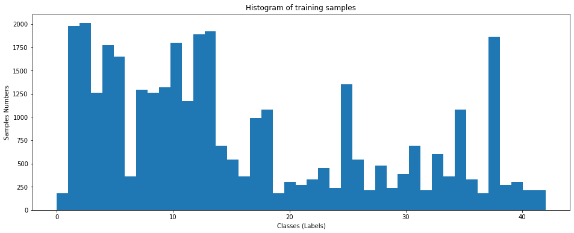

## Project: Build a Traffic Sign Recognition Program

Overview
---
This project is developed to identify German traffic signs using deep neural networks to detect and classify object classes.Convolutional Neural Networks are used in this project with multiple layers. The training ,validation and testing is done using the provided dataset. The model is further executed on a set of 6 images from web to demonstrate its working and classification.

The source code and html files are present in root directory : (i) Traffic_Sign_Classifier.ipynb (ii) Traffic_Sign_Classifier.html

The below steps were followed to achieve the project objectives :
* Load the data set
* Explore, summarize and visualize the data set
* Design, train and test a model architecture
* Use the model to make predictions on new images
* Analyze the softmax probabilities of the new images
* Summarize the results with a written report

## Data Set Exploration

The german traffic data set was explored. It had primarly three files(train,valid,test) which were loaded using pickle and were loaded into python data structures. The images were 3 channel(RBG) and were of the size 32x32 pixels. The object classes were **43** in number.
* Training Images : Training exmaples : **34799**
* Validation Image : Training exmaples : **4410**
* Test Images : Training exmaples : **12630**

The object classes were visually in a histogram to understand the *number of images/class*

