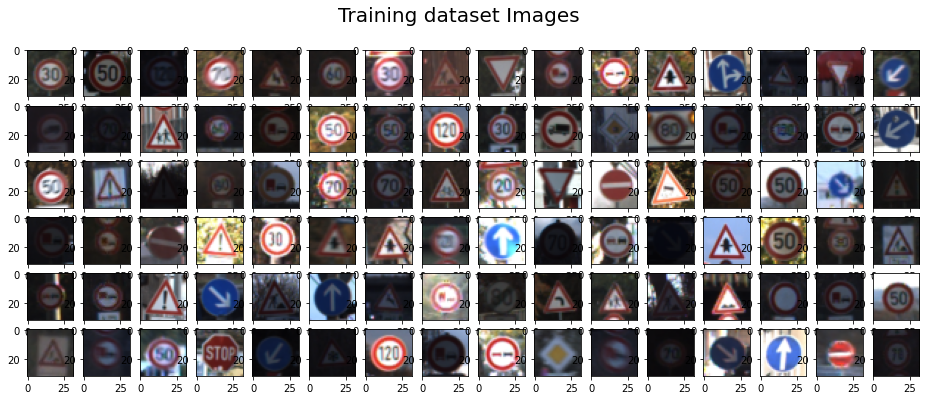
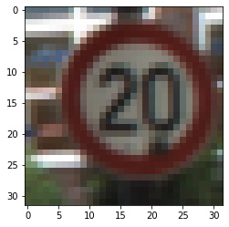
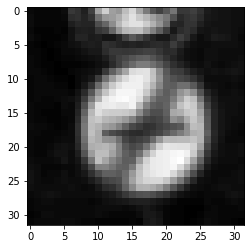
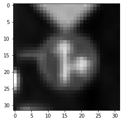
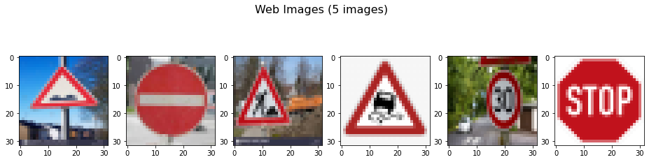

## Project: Build a Traffic Sign Recognition Program
[](http://www.udacity.com/drive)

Project Overview
---
This project is developed to identify German traffic signs using deep neural networks to detect and classify object classes.Convolutional Neural Networks are used in this project with multiple layers. The training ,validation and testing is done using the provided dataset. The model is further executed on a set of 6 images from web to demonstrate its working and classification.

The source code and html files are present in root directory : (i) Traffic_Sign_Classifier.ipynb (ii) Traffic_Sign_Classifier.html

The below steps were followed to achieve the project objectives :
* Load the data set
* Explore, summarize and visualize the data set
* Design, train and test a model architecture
* Use the model to make predictions on new images
* Analyze the softmax probabilities of the new images
* Summarize the results with a written report

## Data Set Exploration (Summary and Visualization)

The german traffic data set was explored. It had primarly three files(train,valid,test) which were loaded using pickle and were loaded into python data structures. The images were 3 channel(RBG) and were of the size 32x32 pixels. The object classes were **43** in number.
* Training Images : Training exmaples : **34799**
* Validation Image : Training exmaples : **4410**
* Test Images : Training exmaples : **12630**

The object classes were visually in a histogram to understand the *number of images/class*


The training data set images were visualised to understand the variations,orientations.



A particular class images were also visualed and analysed (for ex. speed sign 20)



## Data Pre-processing

The image data were normalised by following two steps , namely 
(Reference - Jupyter notebook file-Section "Preprocess the data set",Line# 14-15)

* Converting to Grayscale image
* Normalising using mean and std deviation 

```
gray = cv2.cvtColor(images[i], cv2.COLOR_RGB2GRAY)[:,:,None]
imgset[i] =((gray - 128.)/ 128.)
```

  

Tha advantage of normalizing the image data is that the data size/values have come down considerably. The data value now ranges between -1 to 1. This reduces the training time.

```
##<Image Set>                : <Image Set Dimension>     <Mean>             <Std Dev>      <Min Val> <Max Val>
##Normalized Training images : (34799, 32, 32, 1) -0.36002150343500294 0.5166752015590781 -0.9765625 0.9921875
##Normalized Validation images :(4410, 32, 32, 1) -0.35348885464830465 0.5317113027794368 -0.9609375 0.9921875
##Normalized test images :(12630, 32, 32, 1) -0.36501965315117313 0.5214284135382008 -0.96875 0.9921875
```

## Model Architecture, training and Validation

The model architecture is based on LeNet CNN model having below CNNs,Pooling and Fully connected layers : 
(Reference - Jupyter notebook file-Section "Model Architecture",Line# 1-48)

* Layer 1: Convolutional. Input = 32x32x1. Output = 28x28x6.
* Max Pooling. Input = 28x28x6. Output = 14x14x6.
* Layer 2: Convolutional. Input = 14x14x6. Output = 10x10x16.
* Max Pooling. Input = 10x10x16. Output = 5x5x16.
* Layer 3: Fully Connected. Input = 400. Output = 120.
* Layer 4: Fully Connected. Input = 120. Output = 84.
* Layer 5: Fully Connected. Input = 84. Output = 43.

Learning rates, Epoch and Batch were chosen as below :
```
EPOCHS = 200
BATCH_SIZE = 128
rate = 0.005
```

Also, Adam optimiser was used to train network 
```
logits = LeNet(x)
cross_entropy = tf.nn.softmax_cross_entropy_with_logits(labels=one_hot_y, logits=logits)
loss_operation = tf.reduce_mean(cross_entropy)
optimizer = tf.train.AdamOptimizer(learning_rate = rate)
training_operation = optimizer.minimize(loss_operation)
```

The model was evaluated and analysed with different values in an iterative manner.The model was tested with non-gray scale images and un-normalised values. The results were not up to the mark.The model gave better results using gray scale images and trained faster with normalised values.

The model was trained and validated in the jupyter code file, section - "Train, Validate and Test the Model", Line #:1 -50.

Model results are as follows - 
* Accuracy of Training Images : 0.989  
* Accuracy of Validation Images (Epochs) : > 0.93 
* Accuracy of Training Images : 0.902

## Testing Models on Web Images

Six German traffic sign images were downloaded from web. The classes were checked from *signnames.csv* and accordingly the data set was created to run and validate model. (Reference - Jupyter notebook file-Section "Test a Model on new Images",Line# 1-25)



The web images were scaled to 32x32 and gray-scaled,normalised as was done for train,valid,test set for the execution on model.

The following resuls were obtained after model was executed on the web images :

```
Predicted Labels : 
[ 5 17 38  5 30  5]
Actual Labels:
[22 17 25 23 30 14]

Image number  1 :--> Incorrect Prediction 
Image number  2 :--> Correct Prediction 
Image number  3 :--> Incorrect Prediction 
Image number  4 :--> Incorrect Prediction 
Image number  5 :--> Correct Prediction 
Image number  6 :--> Incorrect Prediction 
```
The accuracy for the web images equals: 33.33 %

The images w


